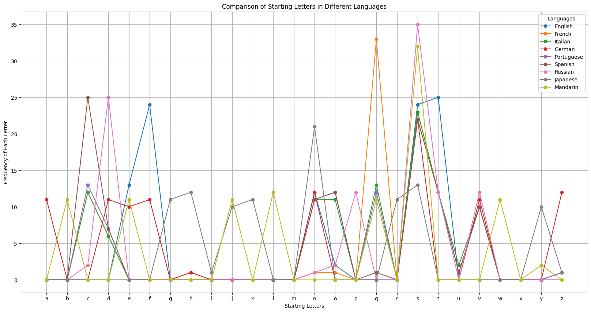
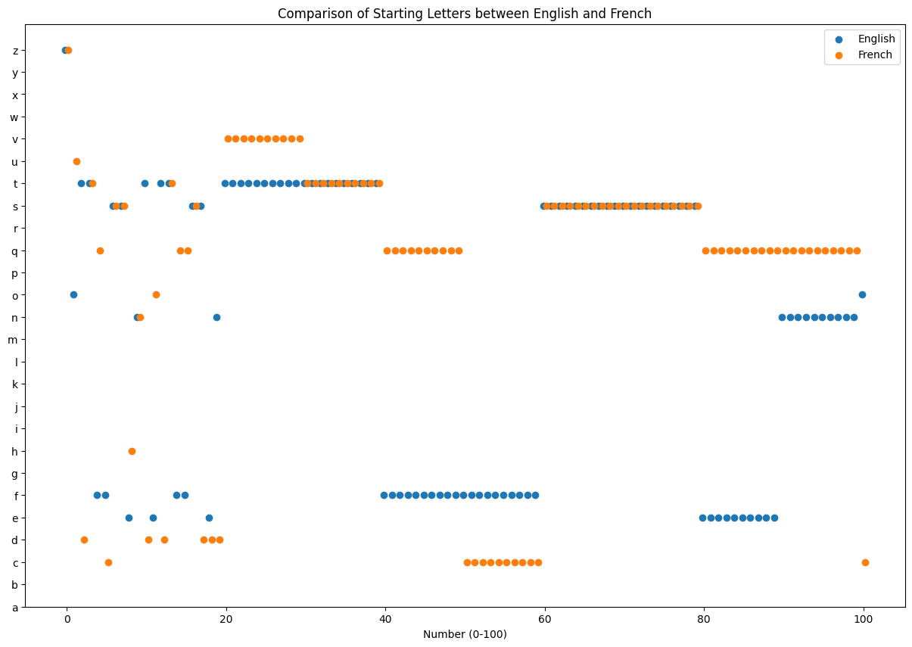
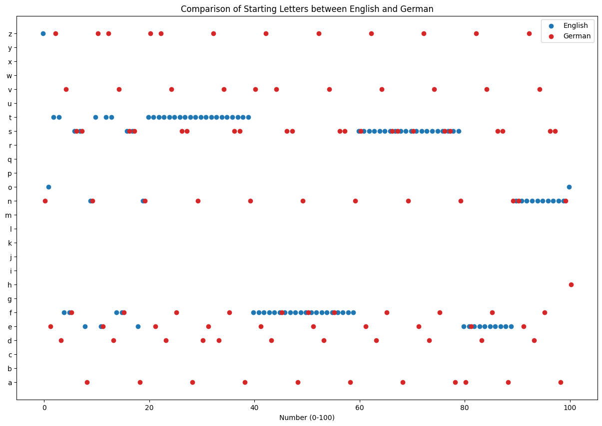

# 0to100
This project explores how numbers from 0 to 100 are named in different languages by analyzing the starting letters of each number name. The goal is to visually compare these starting letters across languages to identify similarities and differences in linguistic patterns. 

## View the Notebook

You can view the primary analysis in the Jupyter Notebook. Click the link below to open it directly in GitHub:

[Open the 0to100.ipynb notebook](0to100.ipynb)

## Sneak Peek

Here’s a glimpse of what you’ll find in the Jupyter notebook:

## Running the Notebook Locally

To run the notebook on your local machine:

1. Clone this repository.
2. Ensure you have Jupyter installed, or install it via `pip install notebook`.
3. Navigate to the repository directory and launch Jupyter Notebook.
4. Open the `0to100.ipynb` file from the Jupyter interface.

## Contact

Stefano Lavoro – stefano_lavoro@outlook.com

Project Link: [https://github.com/StefanoLavoro/0to100](https://github.com/StefanoLavoro/0to100)
